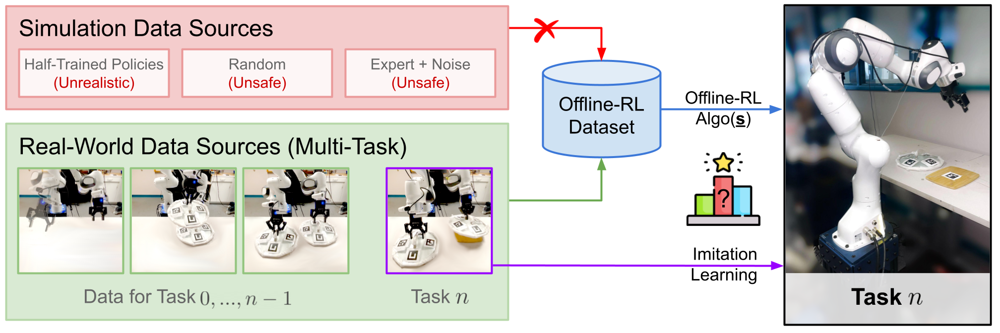

# Real World Offline Reinforcement Learning with Realistic Data Source

[[Arxiv]](https://arxiv.org/abs/2210.06479) [[Code]](https://github.com/gaoyuezhou/real_orl) [[Data]](https://drive.google.com/drive/folders/1BGsG38vfXHjT2_yASP2D9HU2lLCwXA6T?usp=sharing) [[Project Page]](https://sites.google.com/view/real-orl)




## Abstract
Offline reinforcement learning (ORL) holds great promise for robot learning due to its ability to learn from arbitrary pre-generated experience. However, current ORL benchmarks are almost entirely in simulation and utilize contrived datasets like replay buffers of online RL agents or sub-optimal trajectories, and thus hold limited relevance for real-world robotics. In this work (Real-ORL), we posit that data collected from safe operations of closely related tasks are more practical data sources for real-world robot learning. Under these settings, we perform an extensive (6500+ trajectories collected over 800+ robot hours and 270+ human labor hour) empirical study evaluating generalization and transfer capabilities of representative ORL methods on four real-world tabletop manipulation tasks. Our study finds that ORL and imitation learning prefer different action spaces, and that ORL algorithms can generalize from leveraging offline heterogeneous data sources and outperform imitation learning. 

## Dataset

We release the Real-ORL dataset that we used for all of our experiments. The parsed and raw datasets can be downloaded [here](https://drive.google.com/drive/folders/1BGsG38vfXHjT2_yASP2D9HU2lLCwXA6T?usp=sharing).

### Tasks

#### Reaching
- Random initial &  goal positions in the air
- 1000 trajectories
#### Sliding
- Random initial & goal positions on the table
- 731 trajectories
#### Lifting
- Random initial positions on the table
- 616 trajectories
#### Pick-n-place (pnp)
- Random initial & goal positions on the table
- 609 trajectories

### Parsed Data
The data is parsed into a python list of dictionaries, where each dictionary is a trajectory. The keys of each dictionary are as follows:
- `'observations'`: numpy array of shape (*horizon*, 7). Contains the robot's jointstates (as absolute joint angles) at each timestep
- `'actions'`: numpy array of shape (*horizon*, 7). Contains the robot's actions (as absolute joint angles) at each timestep
- `'rewards'`: numpy array of length (*horizon*, ). The reward is sparse, which means the reward at all but the last step is 0. We haven’t done any normalization for the reward in the current version
- `'terminated'`: numpy array of length (*horizon*, ). This denotes whether the trajectory is terminated at each timestep, so all the entries is 0 except the last entry being 1

### Raw Data
Our raw data contains a Franka Panda robot arm's proprioceptions, actions (absolute joint angles), and image observations from two camera views at each time step. The cameras are calibrated and relevant objects are tracked by AprilTags so we can recover the ground truth position of the objects. We also provide scripts to parse the raw data:
```
python scripts/parse_pushing.py -f </path/to/raw/pushing/dataset/folder> 
```
We define our reward functions in `rewards/<task>.py` for training various offline reinforcement learning policies. 

## Agents

For all evaluations, we compare four algorithms: 
- Behavior Cloning (BC)
- Model-based Offline REinforcement Learning (MOREL) 
- Advantage-Weighted Actor Critic (AWAC)
- Implicit Q-Learning (IQL) 

We refer to [mjrl](https://github.com/aravindr93/mjrl)'s implementation for MOREL and [d3rlpy](https://github.com/takuseno/d3rlpy)'s implementation for AWAC and IQL, and release our code under `agents/`.

## Citation

```
@misc{zhou2022real,
      title={Real World Offline Reinforcement Learning with Realistic Data Source}, 
      author={Gaoyue Zhou and Liyiming Ke and Siddhartha Srinivasa and Abhinav Gupta and Aravind Rajeswaran and Vikash Kumar},
      year={2022},
      eprint={2210.06479},
      archivePrefix={arXiv},
      primaryClass={cs.RO}
}
```
